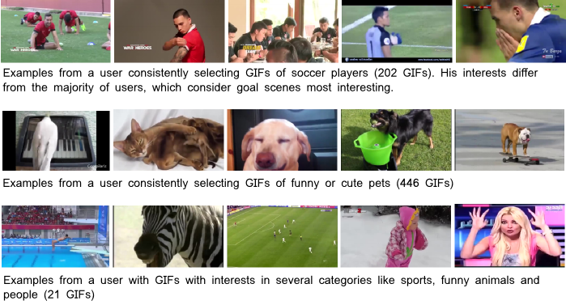

# PHD<sup>2</sup>: Personalized Highlight Detection Dataset

This repository contains PHD<sup>2</sup>, a dataset with personalized highlight information.
As such, it allows to train highlight detection models that use
information about the user, when making predictions.
The dataset contains information from more than __13'000 users__. 

## Motivation
Highlight detection algorithms automatically reduce a
video to its most interesting moments. Even though this
notion of *interestingness is subjective*, existing works only
learn *generic highlight models*, which limits their potential
performance. To achieve better performance, models need to rely on
information about the user for which it should extract highlights.

Previously, such data was unavailable in the research community,
which prevented the research on personalized highlight detection models.
Thus, at gifs.com, we created a large-scale dataset of users
and the GIFs they created, which provides an accurate indication
of their interests.
On this data, models can be trained to make personalized,
and thus more accurate, predictions.
Indeed, as we show in our [paper](https://arxiv.org/abs/1804.06604) [1], making models personalized improves the performance over generic highlight detection
models such as [2] by a significant margin.

We are happy to publicly release this dataset to the research community
and hope that it will spur research on personalized
highlight detection.

## Dataset Description
The dataset contains information on what video segments a specific user considers a highlight.
Having this kind of data allows for strong personalization
models, as specific examples of what a user is interested
in help models obtain a fine-grained understanding
of that specific user.

The data consists of YouTube videos, from which gifs.com
users manually extracted their highlights, by creating GIFs
from a segment of the full video.
Thus, the dataset is similar to that of [1], with two major differences.
1. Each selection is associated with a user, which is what allows
personalization.
2. [1] used visual matching to find the position in the video
from which a GIF was selected. Instead, we directly use the timestamps,
which we have internally available.
Thus, the ground truth is free from any alignment errors.

__Training set__
The training set contains highlights from 12'972 users. 
You can find it [here](training.csv).

__Test set__
The test set contains highlights from 850 users. 
You can find it [here](testing.csv).

### Dataset example


### More information
For more information on the dataset, see our paper [1].

## Using the dateset
### Data format
The data is stored in csv files.
They have the following fields:

```
youtubeId       the source youtube video
start           start of the highlight selection (in seconds)
duration        duration of the selection (in seconds)
user_id         the ID of that user
video_duration  the full video duration
is_last         is this video the last one the user selected highlights from? (boolean)
```

Most fields should be self-explanatory.
The `is_last` field indicates if that particular video 
was the last the user extracted highlights from.
This information is needed for predicting the highlights
for a user, given his previously created GIFs.

To make this more clear, consider this user (id 12999) from the test set:

```csv
youtubeId,start,duration,user_id,video_duration,is_last
dhuI9TO1rY8,204.39,7.08,12999,314.0,True
dhuI9TO1rY8,206.29,5.29,12999,314.0,True
Z-aTqtRBTIM,0.0,7.66,12999,8.0,False
An7ylfOhlOs,82.99,7.55,12999,133.0,False
EFweWyBUFk4,238.95,7.13,12999,561.0,False
2GSS6rSn5Gk,384.05,6.91,12999,1027.0,False
WSEsOJQJ990,0.0,2.08,12999,3.0,False
H9tPfQNXFy8,128.607,8.75021,12999,143.0,False
```

There is one video (2 rows) which has `is_last==True`.
Thus, a highlight detection model that uses information about
the user would predict the users highlight selection on this video:
 ```csv
youtubeId,start,duration,user_id,video_duration,is_last
dhuI9TO1rY8,204.39,7.08,12999,314.0,True
dhuI9TO1rY8,206.29,5.29,12999,314.0,True
```

by using the information on the previous video segments
the user selected:
```csv
youtubeId,start,duration,user_id,video_duration,is_last
Z-aTqtRBTIM,0.0,7.66,12999,8.0,False
An7ylfOhlOs,82.99,7.55,12999,133.0,False
EFweWyBUFk4,238.95,7.13,12999,561.0,False
2GSS6rSn5Gk,384.05,6.91,12999,1027.0,False
WSEsOJQJ990,0.0,2.08,12999,3.0,False
H9tPfQNXFy8,128.607,8.75021,12999,143.0,False
```
 
### Downloading the videos
For using the dataset, you need to first get the videos from YouTube.
We recommend using [pafy](http://pythonhosted.org/Pafy/) or
[youtube-dl](https://rg3.github.io/youtube-dl/) for this.

### Evaluation metrics
We encourage using mAP, nMSD and Recall as the performance metrics.
For reference, our model obtains `mAP=16.68%`, `nMSD=40.26%` and `Recall@5=30.71%`, while the public model of [1] obtains
`mAP=15.69%`, `nMSD=42.59%` and `Recall@5=27.28%` on the 850 test videos which have `is_last==True`.
You can find the implementation on mAP and nMSD [here](https://github.com/gyglim/video2gif_dataset).

## Citation
If you use this dataset, please cite our paper:

```
@article{gifs2017highlights,
   author = {Gygli, Michael and García del Molino, Ana },
   title = {{PHD-GIFs: Personalized Highlight Detection for Automatic GIF Creation}},   
   journal = {arXiv preprint arXiv:1804.06604},
   year = {2018},
   type = {Journal Article}
}
```

## References
[1] PHD-GIFs: Personalized Highlight Detection for Automatic GIF Creation. A. García del Molino, M. Gygli. ACM Multimedia 2018. https://arxiv.org/abs/1804.06604

[2] Video2GIF: Automatic Generation of Animated GIFs from Video.  M. Gygli, Y. Song, L. Cao. CVPR 2016
https://arxiv.org/abs/1605.04850
